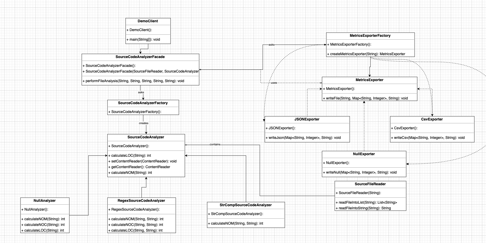

# Refactored source code analyzer

This is the refactored version of the Source Code Analyzer system. The following sections present the Class Diagram of the system and the design patterns used in order to satisfy specific design decisions and requirements.

## Module design

The following class diagram visualizes the refactored source code analyzer. 

# Build and execute the project

1. Build the executable Java application with: 
	mvn package jacoco:report

2. Run the executable by executing
	java –jar “jar-with-dependencies” arg0 arg1 arg2 arg3 arg4
were args translate to: 	
	arg0 = “JavaSourceCodeInputFile” (e.g., src/test/resources/TestClass.java)
	arg1 = “sourceCodeAnalyzerType” [regex|strcomp]
	arg2 = “SourceCodeLocationType” [local|web]
	arg3 = “OutputFilePath” (e.g., ../output_metrics_file)
	arg4 = “OutputFileType” [csv|json]
example: 
	java –jar ./target/sourcecodeanalyzer-0.0.1-SNAPSHOT-jar-with-dependencies.jar ./src/test/resources/TestClass.java regex local metrics_results csv

# Used patterns

-**Factory**

Factory Method Pattern allows the sub-classes to choose the type of objects to create. It promotes the loose-coupling by eliminating the need to bind application-specific classes into the code

Used on : '''MetricsExporterFactory''' , '''SourceCodeAnalyzerFactory'''

-**Strategy**

The Strategy pattern lets you indirectly alter the object's behavior at runtime by associating it with different sub-objects which can perform specific sub-tasks in different ways. Use the Strategy when you have a lot of similar classes that only differ in the way they execute some behavior

-**Facade**

It shields the clients from the complexities of the sub-system components. It promotes loose coupling between subsystems and its clients 
